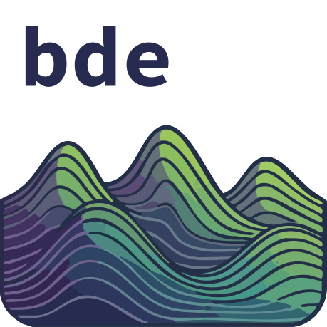

---
# listing:
#   - id: software
#     contents: listings/pub/software.yml
#     template: html/listing.ejs
---

#  Publication Highlights

For a complete list of publications, please refer to my [Google Scholar](https://scholar.google.com/citations?user=qa2P1tYAAAAJ&hl=en) profile.

::: {.card .mb-4 .shadow-sm}
::: {.card-body}
[ICLR 2025]{.badge .bg-primary .float-end}
**Microcanonical Langevin Ensembles: Advancing the Sampling of Bayesian Neural Networks**

**Emanuel Sommer**, Jakob Robnik, Giorgi Nozadze, Uros Seljak, David Rügamer

[ Paper](https://arxiv.org/abs/2502.06335) | [ Conference](https://iclr.cc/)

[Bayesian Deep Learning]{.badge .bg-light .text-dark} [Sampling-based Inference]{.badge .bg-light .text-dark} [MCMC]{.badge .bg-light .text-dark} [UQ]{.badge .bg-light .text-dark}
:::
:::

::: {.card .mb-4 .shadow-sm}
::: {.card-body}
[ICML 2024]{.badge .bg-primary .float-end}
**Connecting the Dots: Is Mode-Connectedness the Key to Feasible Sample-Based Inference in Bayesian Neural Networks?**

**Emanuel Sommer**\*, Lisa Wimmer\*, Theodore Papamarkou, Ludwig Bothmann, Bernd Bischl, David Rügamer

[ Paper](https://proceedings.mlr.press/v235/sommer24a.html) | [ Conference](https://icml.cc/)

[BNNs]{.badge .bg-light .text-dark} [Mode-Connectedness]{.badge .bg-light .text-dark}  [Sampling-based Inference]{.badge .bg-light .text-dark} [Symmetries]{.badge .bg-light .text-dark}
:::
:::

::: {.card .mb-4 .shadow-sm}
::: {.card-body}
[Econometrics and Statistics]{.badge .bg-primary .float-end}
**Vine Copula based Portfolio Level Conditional Risk Measure Forecasting**

**Emanuel Sommer**, Karoline Bax, Claudia Czado

[ Paper](https://doi.org/10.1016/j.ecosta.2023.08.002) | [ Journal](https://www.sciencedirect.com/journal/econometrics-and-statistics)

[Dependence Modeling]{.badge .bg-light .text-dark} [Vine Copulas]{.badge .bg-light .text-dark} [Portfolio Risk]{.badge .bg-light .text-dark} [Stress Testing]{.badge .bg-light .text-dark} [Time Series]{.badge .bg-light .text-dark}
:::
:::

* Equal contribution

------------------------------------------------------------------------

#  Software

::: {.card .mb-3 .shadow-sm}
::: {.card-body}
:::: {.columns}
::: {.column width="20%"}
{width="90%"}
:::
::: {.column width="80%"}
### {portvine} [ Package]{.badge .bg-secondary .text-dark .ms-2}
Portfolio-level unconditional as well as conditional risk measure estimation (VaR/Expected Shortfall) using Vine Copulas and ARMA-GARCH models. Designed for backtesting and stress testing.

[ CRAN](https://cloud.r-project.org/package=portvine) | [ GitHub](https://github.com/EmanuelSommer/portvine) | [ Docs](https://emanuelsommer.github.io/portvine/)
:::
::::
:::
:::

::: {.card .mb-3 .shadow-sm}
::: {.card-body}
:::: {.columns}
::: {.column width="20%"}
{width="90%"}
:::
::: {.column width="80%"}
### {bde} [ Package]{.badge .bg-secondary .text-dark .ms-2}
Bayesian Deep Ensembles (specifically **MILE**) implementation compatible with `scikit-learn` and focused on tabular data. Leverages **JAX** for accelerator-backed training and inference.

[ GitHub](https://github.com/vyron-arvanitis/bde) | [ Docs](https://vyron-arvanitis.github.io/bde/)
:::
::::
:::
:::
